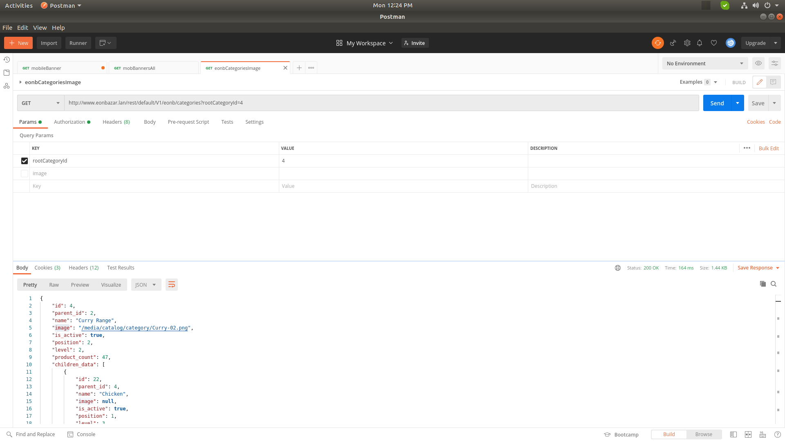

## Magento 2 EonInfosys_Catalog

Magento_Catalog Core Module no Category image Api end-Point , this module added Category img url Cart api end point

Methods: Get
Url: http://www.eonbazar.lan/rest/default/V1/eonb/categories?rootCategoryId=4

